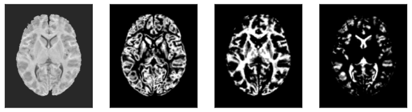

# Machine Learning Approaches for Comorbidity Prediction Based on sMRI

## Abstract

Children and adolescents with mental health problems are often diagnosed with multiple psychiatric disorders, a phenomenon described as comorbidity. While past studies of psychiatric disorder prediction based on neuroimaging data have used a case-control approach to predict a specific disorder, the objective here was to predict multiple disorders concurrently, corresponding to a multi-label classification task. In this study, a large pediatric sample originating from the [HBN initiative](http://fcon_1000.projects.nitrc.org/indi/cmi_healthy_brain_network/About.html) was used. Prior to the analysis, structural MRI scans of 3,650 subjects were preprocessed using the [sMRIprep](https://www.nipreps.org/smriprep/) pipeline, which resulted in two types of features used for the subsequent analysis: morphometric measures based on FreeSurfer derivatives and preprocessed T1w images. Further, 13 distinct diagnostic categories were used as labels. As part of the main analysis, univariate statistical tests were carried out to identify potential confounding effects and to quantify associations between the input features and the diagnostic labels. Finally, different machine learning models, including linear, non-linear, and neural-network-based models, were fitted using two approaches: a separate approach, where a separate classifier was fitted for every label, and a combined approach, where a single model was trained for all labels. The models were evaluated with respect to different performance metrics, and the results were compared to baseline estimates.

## Technical Documentation

This repository contains all relevant code for the analysis, including:
- [Data inspection](data_inspection.ipynb)
- [Statistical analysis](statistical_analysis.ipynb)
- Fitting non-optimized binary classifiers with [meta estimators](meta_estimator_analysis.ipynb) on morphometric features
- Fitting [optimized binary classifiers](individual_estimator_analysis.ipynb) on morphometric features
- Training a [FNN](fnn.ipynb) on morphometric features
- [Training](sfcn_train.py) and [evaluating](sfcn_eval.py) a 3D-CNN on brain imaging data

## sMRI Preprocessing

The technical documentation of the sMRI preprocessing operation can be found in a separate [repository](https://github.com/braindatalab/mri_preprocessing).
